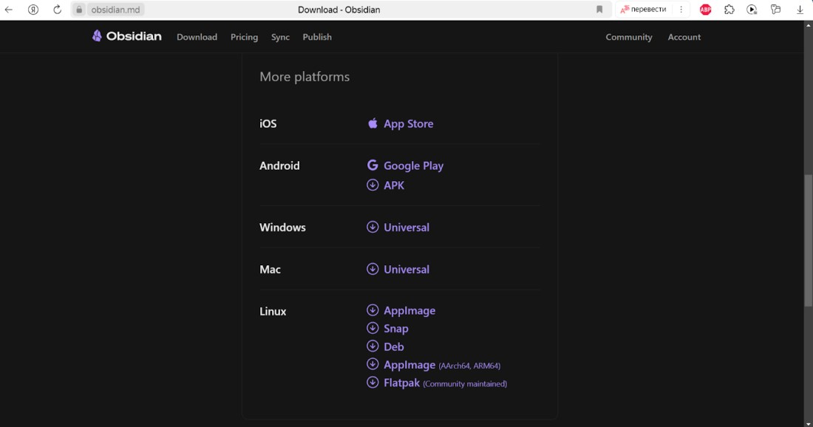
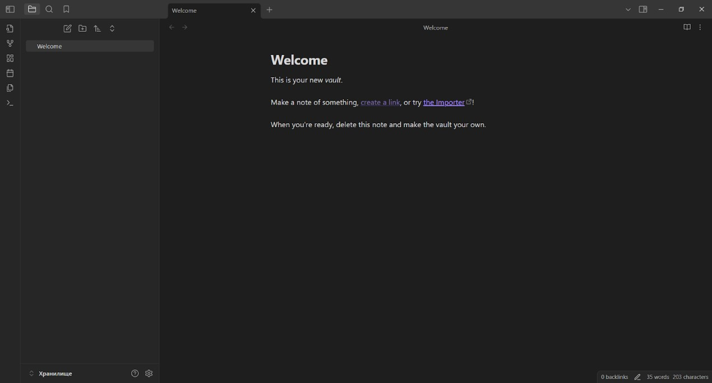
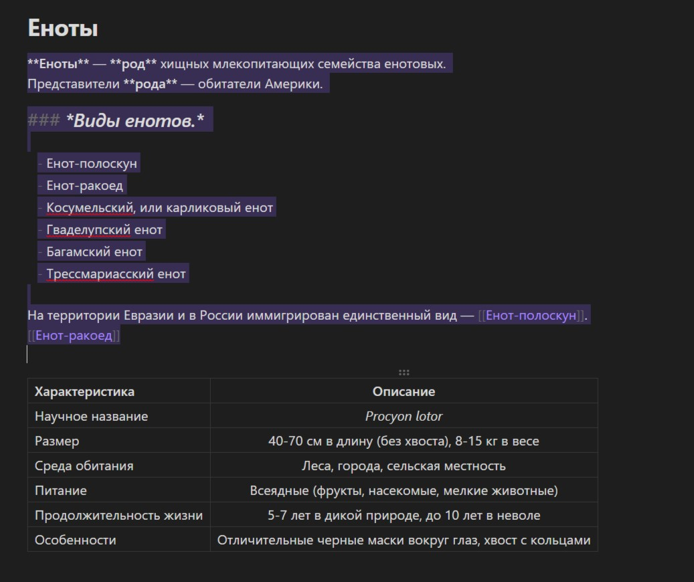
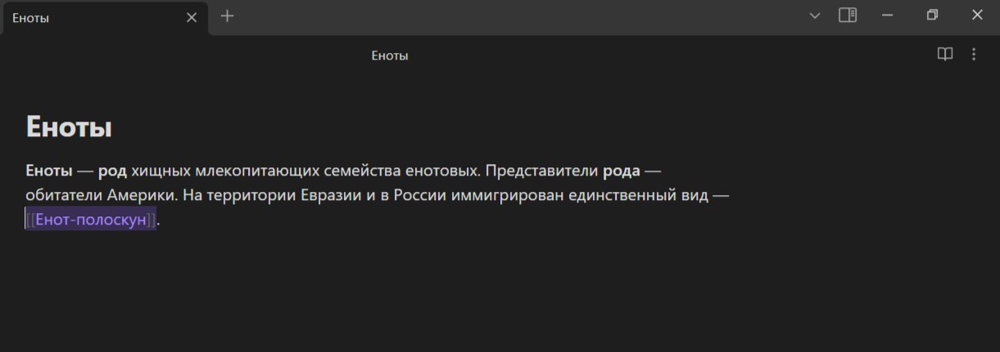
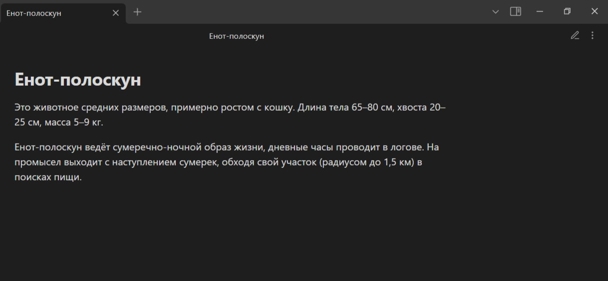
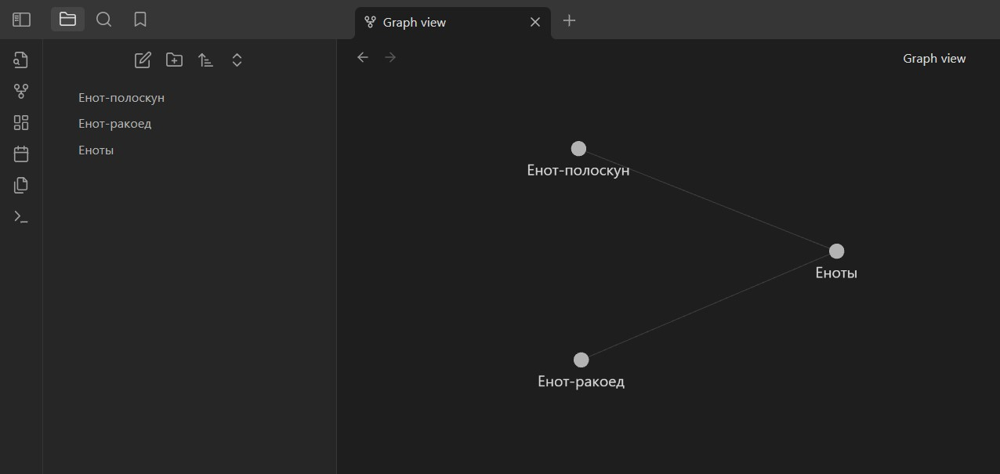
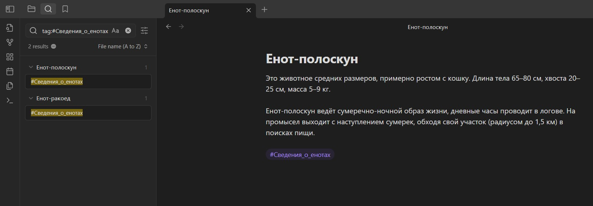

# **Obsidian. Первые шаги.**

## Введение.
Obsidian — это программа для ведения заметок на основе Markdown. Данный инструмент позволяет решать многие задачи по работе и структуризации текста в удобном формате. Данные мгновенно переформатируются с языка разметки и пригодны для предварительного просмотра. 

Obsidian можно назвать личной автономной базой данных, все данные сохраняются локально и взаимосвязаны благодаря внутренним ссылкам между заметками. Программа имеет открытый исходный код, вы можете улучшать элементы интерфейса под собственные нужды, создавая или пользуясь чужими плагинами.

## Подготовка к работе.

Первичное знакомство начинается с установки интерфейса программы. Для этого необходимо зайти на официальный сайт разработчика obsidian.md и скачать дистрибутив, предназначенный для вашего вида устройства. 
# 
Obsidian — это кроссплатформенная программа, поэтому вы сможете установить её на любое устройство и использовать функционал в полном объёме. После скачивания и запуска программы открывается текстовый редактор.
Весь пользовательский интерфейс очень прост, ориентирован исключительно на написание заметок.  Большая часть пространства отведена под отображение файлов. Слева находится панель с инструментами для создания и редактирования документов, окно навигации по структуре файловой системы. 
# 

## Основы работы.

Создание заметок автоматически происходит в формате Markdown. Синтаксис достаточно прост для запоминания. Здесь представлены его основные возможности:
# 
Использование комбинации клавиш Ctrl + N подходит для создания новой заметки. Есть возможность открытия несколько заметок в разделенных окнах и переключения между ними с помощью команд клавиатуры. 
Для переключения между режимом редактирования и просмотра необходимо использовать сочетания клавиш CTRL + E.

## Связь между заметками.

Одной из ключевых особенностей Obsidian является возможность создания связей между заметками, что позволяет пользователям строить сложные взаимосвязи между различными фрагментами информации.
Связь между заметками формируется с помощью ссылок.
Вы можете создать ссылку на другую заметку, используя специальный синтаксис, например, [[Имя заметки]]. Когда пользователь кликает на эту ссылку, Obsidian открывает соответствующую заметку.
# 

## Использование графа заметок.

Графы в Obsidian — это визуальное представление связей между заметками. Obsidian работает как второй мозг — пространство, где пользователи могут создавать заметки соединяется в личную и сложную сеть. 
# 
Граф отображает заметки как узлы, а связи между ними - как ребра. Это позволяет пользователям видеть, как различные фрагменты информации связаны друг с другом.

## Добавление тегов.

Теги — это метки, которые вы можете добавлять к заметкам для их категоризации и облегчения поиска. В Obsidian вы можете использовать символ #, чтобы создать тег. Например:
# 
Теги помогают быстро находить заметки по определённой теме и делают структуру ваших заметок более организованной.

## Создание шаблонов.

Шаблоны позволяют создавать предустановленные форматы заметок. Это удобно, если вы часто используете одно и то же структурирование — например, для заметок о встречах, книгах или проектах. Для создания шаблонов вы можете использовать, как готовые шаблоны, так и свои собственные.

## Плагины

Плагины расширяют функциональность Obsidian, добавляя новые возможности. В сообществе доступно множество плагинов, которые могут помочь вам в организации информации, автоматизации задач, визуализации связей и даже интеграции с другими сервисами.

## **Заключение**

Obsidian — это универсальный инструмент, который помогает структурировать, организовывать и визуализировать информацию. Надеемся, что это руководство поможет вам начать работу с Obsidian!
